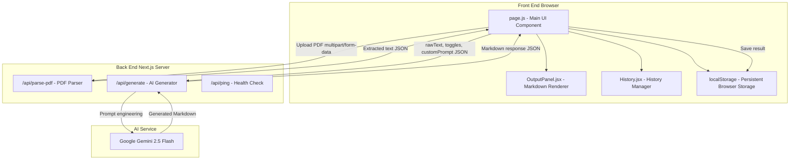
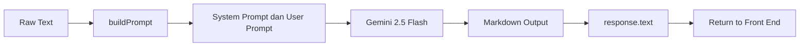
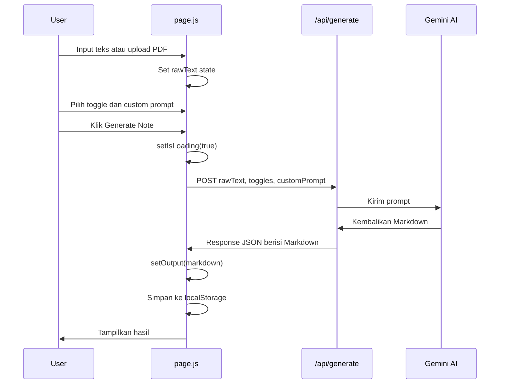

# Laporan Proyek Markdown Generator

## Smart Markdown Note Generator

**Nama proyek:** Markdown Generator
**Jenis proyek:** Final Project Seleksi Admin Lab Algoritma dan Pemrograman ITS  
**Author:** Mitra Partogi dan Jalu Cahyo Sedinoputro  
**Teknologi utama:** Next.js, Tailwind CSS, Google Gemini AI

---

## Abstrak

FP kami adalah aplikasi web yang dirancang untuk membantu pengguna mengubah teks mentah atau konten dari file PDF menjadi catatan Markdown yang rapi, terstruktur, dan mudah dibaca. Aplikasi ini menggabungkan antarmuka berbasis React, server-side API dari Next.js, pemrosesan file PDF, penyimpanan riwayat di browser, serta integrasi model Google Gemini untuk menghasilkan catatan otomatis.

Proyek ini berfokus pada penyederhanaan proses pencatatan digital. Pengguna dapat menempelkan teks secara manual atau mengunggah file PDF, kemudian memilih opsi tambahan seperti ringkasan, flashcard, dan to-do list. Hasil akhir ditampilkan dalam dua mode, yaitu pratinjau Markdown yang sudah dirender dan tampilan raw Markdown yang dapat disalin langsung.

---

## 1. Pendahuluan

Dalam kegiatan belajar, dokumentasi, dan pengolahan informasi, pengguna sering berhadapan dengan teks panjang yang belum tersusun dengan baik. Teks dari catatan kasar, artikel, materi kuliah, atau dokumen PDF sering membutuhkan waktu tambahan untuk dirapikan menjadi format yang lebih mudah dibaca. MarkMind dibuat untuk menjawab kebutuhan tersebut dengan memanfaatkan teknologi web modern dan kecerdasan buatan.

Aplikasi ini tidak hanya mengubah teks menjadi Markdown, tetapi juga memberikan fleksibilitas kepada pengguna untuk menentukan bentuk keluaran. Pengguna dapat meminta ringkasan singkat, daftar flashcard tanya-jawab, atau checklist to-do list. Dengan pendekatan tersebut, MarkMind dapat digunakan sebagai alat bantu belajar, dokumentasi, dan pengorganisasian informasi.

---

## 2. Tujuan Proyek

Tujuan utama proyek MarkMind adalah membangun aplikasi web yang mampu menerima input berupa teks atau PDF, memprosesnya melalui API server, lalu menghasilkan catatan Markdown secara otomatis menggunakan layanan AI.

Secara lebih spesifik, proyek ini memiliki beberapa tujuan teknis. Pertama, menyediakan antarmuka pengguna yang responsif dan mudah digunakan. Kedua, mengimplementasikan fitur upload PDF dengan validasi tipe dan ukuran file. Ketiga, membangun API untuk parsing PDF dan generasi konten AI. Keempat, menyimpan hasil generasi sebelumnya secara lokal melalui `localStorage`. Kelima, menampilkan keluaran Markdown dalam mode preview dan raw agar pengguna dapat membaca maupun menyalin hasil dengan mudah.

---

## 3. Ruang Lingkup Aplikasi

Ruang lingkup MarkMind mencakup proses input, pemrosesan, generasi, tampilan, dan penyimpanan riwayat catatan. Input yang didukung terdiri dari teks manual dan file PDF. Pemrosesan PDF dilakukan di sisi server menggunakan library `pdf-parse`, sedangkan generasi Markdown dilakukan melalui endpoint API yang berkomunikasi dengan Google Gemini.

Aplikasi ini berjalan sebagai proyek full-stack berbasis Next.js App Router. Bagian front end menangani interaksi pengguna, pengelolaan state, tampilan hasil, dan riwayat. Bagian back end menangani validasi request, parsing PDF, health check, serta pemanggilan layanan AI. Penyimpanan permanen berbasis database belum menjadi bagian dari proyek ini karena riwayat disimpan secara lokal di browser pengguna.

---

## 4. Teknologi yang Digunakan

| Teknologi | Versi | Fungsi |
|---|---:|---|
| Next.js | 16.2.4 | Framework full-stack berbasis React dengan App Router dan API Routes |
| React | 19.2.4 | Library utama untuk membangun antarmuka pengguna |
| Tailwind CSS | 4 | Framework CSS utility-first untuk styling antarmuka |
| react-markdown | 10.1.0 | Library untuk merender Markdown menjadi elemen React |
| lucide-react | 1.14.0 | Library ikon, tersedia dalam proyek meskipun sebagian ikon menggunakan SVG manual |
| pdf-parse | 2.4.5 | Library untuk mengekstrak teks dan metadata dari file PDF |
| @google/genai | 1.52.0 | SDK resmi untuk mengakses Google Gemini API |
| Geist Font | - | Font modern dari Vercel yang diimpor melalui `next/font` |

---

## 5. Arsitektur Sistem

MarkMind menggunakan arsitektur full-stack berbasis Next.js. Front end berjalan di browser, sedangkan API Routes berjalan di server Next.js. Layanan AI berada di luar aplikasi dan diakses melalui Google Gemini API.



Alur tersebut menunjukkan bahwa browser bertugas sebagai pusat interaksi pengguna, sedangkan server bertugas sebagai lapisan pemrosesan yang menjaga API key tetap aman dan menjalankan proses yang tidak dapat dilakukan langsung secara ideal di sisi client, seperti parsing PDF dan pemanggilan layanan AI.

---

## 6. Implementasi Front End

### 6.1 Root Layout

File `app/layout.js` berfungsi sebagai layout utama aplikasi. File ini membungkus seluruh halaman dan mengatur font global menggunakan Geist Sans dan Geist Mono dari `next/font/google`. Font didefinisikan sebagai CSS variable agar dapat digunakan secara konsisten di seluruh aplikasi. Struktur body menggunakan class seperti `min-h-full` dan `flex flex-col` agar halaman dapat mengisi tinggi layar secara penuh.

### 6.2 Global Styles

File `app/globals.css` berisi konfigurasi gaya global. Aplikasi menggunakan tampilan dark mode secara default dengan warna latar gelap dan teks terang. Tailwind CSS v4 digunakan melalui pendekatan design token dengan `@theme inline`. Selain itu, file ini juga mengatur custom scrollbar agar tampilan scroll lebih sesuai dengan desain antarmuka aplikasi.

### 6.3 Halaman Utama

File `app/page.js` merupakan komponen utama aplikasi. File ini berisi logika input, upload PDF, pengiriman request ke API, pengelolaan state, pengelolaan riwayat, dan rendering layout utama. Karena menggunakan fitur browser seperti `useState`, `useEffect`, event handler, `localStorage`, dan upload file, halaman ini berjalan sebagai client component.

State yang dikelola pada halaman utama mencakup teks input, custom prompt, toggle fitur tambahan, status loading, pesan error, output Markdown, tab input aktif, file PDF, status parsing PDF, metadata PDF, status drag-and-drop, riwayat generasi, dan status tampilan panel history.

| State | Tipe | Fungsi |
|---|---|---|
| `rawText` | string | Menyimpan teks mentah dari input manual atau hasil ekstraksi PDF |
| `customPrompt` | string | Menyimpan instruksi tambahan dari pengguna |
| `toggles` | object | Menyimpan pilihan fitur tambahan seperti ringkasan, flashcard, dan todo |
| `isLoading` | boolean | Menandai proses generasi sedang berlangsung |
| `error` | string | Menyimpan pesan error untuk ditampilkan ke pengguna |
| `output` | string | Menyimpan hasil Markdown dari AI |
| `inputTab` | string | Menentukan mode input aktif, yaitu teks atau PDF |
| `pdfFile` | File atau null | Menyimpan file PDF yang dipilih pengguna |
| `pdfStatus` | string | Menyimpan status proses parsing PDF |
| `pdfMeta` | object atau null | Menyimpan metadata PDF seperti jumlah halaman, judul, dan penulis |
| `isDragOver` | boolean | Menandai kondisi file sedang diarahkan ke area drag-and-drop |
| `history` | array | Menyimpan daftar riwayat hasil generasi |
| `showHistory` | boolean | Mengatur visibilitas panel history |

### 6.4 Mode Input

MarkMind menyediakan dua mode input. Mode pertama adalah input teks manual melalui textarea. Mode ini digunakan ketika pengguna ingin menempelkan teks secara langsung ke aplikasi. Mode kedua adalah upload PDF melalui area drag-and-drop atau pemilihan file manual. Pada mode PDF, aplikasi melakukan validasi awal terhadap tipe file dan ukuran file. File yang diterima harus berupa PDF dan memiliki ukuran maksimal 10 MB.

Setelah file PDF berhasil diproses, aplikasi menampilkan informasi seperti nama file, jumlah halaman, ukuran file, dan jumlah karakter yang berhasil diekstrak. Teks hasil ekstraksi tetap dapat diedit sebelum dikirim ke proses generasi Markdown.

### 6.5 Opsi Tambahan

Aplikasi menyediakan tiga opsi tambahan yang dapat diaktifkan pengguna. Opsi ringkasan menghasilkan bagian TL;DR di bagian atas catatan. Opsi flashcard menghasilkan lima pasangan pertanyaan dan jawaban. Opsi to-do list mengekstrak bagian yang relevan menjadi checklist. Ketiga opsi ini dikirim ke back end sebagai bagian dari request sehingga prompt dapat dibangun secara dinamis.

### 6.6 Custom Prompt

Custom prompt adalah input opsional yang memungkinkan pengguna memberikan instruksi tambahan kepada AI. Contohnya adalah meminta gaya bahasa formal, memfokuskan hasil pada bagian algoritma, atau membuat struktur catatan tertentu. Nilai custom prompt tidak berdiri sendiri, tetapi digabungkan dengan instruksi dasar dan opsi tambahan ketika prompt dikirim ke model AI.

### 6.7 Tombol Generate dan Respons Antarmuka

Tombol generate hanya aktif ketika `rawText` berisi teks dan aplikasi tidak sedang berada dalam proses loading. Saat proses berlangsung, aplikasi menampilkan indikator loading untuk memberi umpan balik kepada pengguna. Jika request berhasil, hasil Markdown ditampilkan pada panel output. Jika terjadi error, pesan error ditampilkan pada antarmuka agar pengguna memahami penyebab kegagalan.

### 6.8 Responsivitas Layout

Layout aplikasi dirancang responsif. Pada layar desktop, tampilan utama menggunakan dua kolom: kolom kiri untuk input dan kolom kanan untuk output. Pada layar mobile, layout berubah menjadi susunan vertikal agar tetap nyaman digunakan pada perangkat dengan lebar layar terbatas. Breakpoint utama yang digunakan adalah `lg` atau 1024 piksel.

---

## 7. Komponen OutputPanel

File `app/components/OutputPanel.jsx` bertugas menampilkan hasil Markdown. Komponen ini memiliki dua mode tampilan, yaitu mode preview dan mode raw. Mode preview menggunakan `react-markdown` untuk merender Markdown menjadi elemen HTML yang sudah diberi styling. Mode raw menampilkan Markdown asli dalam bentuk plain text dengan font monospace.

Komponen ini juga menyediakan tombol copy untuk menyalin hasil Markdown ke clipboard. Setelah proses salin berhasil, aplikasi menampilkan umpan balik berupa teks konfirmasi selama dua detik. Fitur ini memudahkan pengguna untuk langsung menggunakan hasil catatan pada editor Markdown atau platform dokumentasi lain.

Styling Markdown dibuat khusus untuk beberapa elemen seperti heading, paragraf, list, blockquote, inline code, code block, bold text, dan horizontal rule. Pendekatan ini membuat hasil Markdown tetap konsisten dengan desain visual aplikasi tanpa mengubah isi Markdown mentah yang dihasilkan oleh AI.

| Elemen Markdown | Perlakuan Styling |
|---|---|
| `h1` | Ukuran besar, warna biru, border bawah, dan efek bayangan teks |
| `h2` | Ukuran menengah dengan warna biru muda |
| `h3` | Ukuran dasar dengan warna indigo |
| `p` | Warna abu-abu terang dan jarak baris nyaman dibaca |
| `ul` dan `ol` | Marker list diberi warna biru |
| `blockquote` | Border kiri biru, latar semi-transparan, dan gaya italic |
| `code` inline | Latar gelap, teks biru, dan sudut membulat |
| `pre` | Latar hitam, border, dan tampilan code block |
| `strong` | Teks putih terang dan tebal |
| `hr` | Garis transparan yang memisahkan bagian konten |

---

## 8. Komponen History

File `app/components/History.jsx` menangani tampilan dan pengelolaan riwayat hasil generasi. Komponen ini menampilkan daftar item history yang berisi judul, preview, dan timestamp. Ketika pengguna memilih salah satu item, hasil Markdown dari riwayat tersebut dimuat kembali ke panel output.

Data riwayat disimpan di `localStorage` dengan key `markdownHistory`. Saat aplikasi pertama kali dimuat, data riwayat dibaca dari `localStorage`. Setiap kali state history berubah, data disimpan kembali. Jumlah item yang disimpan dibatasi maksimal 50 item agar penyimpanan lokal tetap terkontrol.

Struktur data setiap item history terdiri dari `id`, `title`, `preview`, `markdown`, dan `timestamp`. Timestamp diformat menggunakan locale Indonesia sehingga waktu yang ditampilkan lebih sesuai untuk pengguna lokal.

```javascript
localStorage.setItem("markdownHistory", JSON.stringify(history));
```

Pendekatan penyimpanan lokal membuat aplikasi dapat mempertahankan riwayat meskipun halaman di-refresh. Namun, data tersebut tetap terbatas pada browser yang sama dan belum tersinkronisasi lintas perangkat.

---

## 9. Implementasi Back End

Back end MarkMind dibangun menggunakan API Routes pada Next.js App Router. Setiap endpoint ditempatkan dalam folder `app/api` dan didefinisikan melalui file `route.js`. Pendekatan ini memungkinkan proyek memiliki front end dan back end dalam satu basis kode yang sama.

### 9.1 Endpoint Generate

Endpoint `/api/generate` menerima request `POST` dalam format JSON. Endpoint ini bertugas memvalidasi teks input, membangun prompt, memanggil Google Gemini API, dan mengembalikan hasil Markdown.

Contoh struktur request body:

```json
{
  "rawText": "string",
  "toggles": {
    "summary": true,
    "flashcard": false,
    "todo": true
  },
  "customPrompt": "Gunakan gaya formal"
}
```

Validasi pada endpoint ini mencakup pengecekan apakah `rawText` kosong, apakah panjang teks melebihi 20.000 karakter, apakah `GEMINI_API_KEY` tersedia di environment, dan apakah AI mengembalikan konten. Jika validasi gagal, endpoint mengembalikan status code yang sesuai.

| Status | Kondisi |
|---:|---|
| 400 | `rawText` kosong |
| 413 | Teks melebihi batas 20.000 karakter |
| 500 | API key belum diset atau terjadi error server |
| 502 | AI tidak mengembalikan konten |

### 9.2 Endpoint Parse PDF

Endpoint `/api/parse-pdf` menerima request `POST` dalam format `multipart/form-data` dengan field `pdf`. Endpoint ini melakukan validasi file, mengubah file menjadi `Buffer`, mengekstrak teks menggunakan `pdf-parse`, mengambil metadata PDF, lalu mengembalikan teks hasil ekstraksi ke front end.

Validasi endpoint ini mencakup pengecekan content-type, keberadaan field file, tipe file, ukuran file, dan keberadaan teks hasil ekstraksi. Jika file merupakan PDF hasil scan atau gambar tanpa teks, endpoint dapat mengembalikan error karena tidak ada teks yang dapat diekstrak.

| Status | Kondisi |
|---:|---|
| 400 | Field `pdf` tidak ditemukan atau request tidak sesuai |
| 413 | Ukuran PDF melebihi batas 10 MB |
| 415 | File yang dikirim bukan PDF |
| 422 | PDF tidak memiliki teks yang dapat diekstrak |

Endpoint ini menggunakan konfigurasi khusus berikut:

```javascript
export const runtime = "nodejs";
export const dynamic = "force-dynamic";
```

Konfigurasi `runtime = "nodejs"` diperlukan karena `pdf-parse` membutuhkan fitur Node.js seperti `Buffer`. Konfigurasi `dynamic = "force-dynamic"` digunakan agar endpoint selalu diproses secara dinamis dan tidak menggunakan cache, karena setiap request upload PDF dapat berisi file yang berbeda.

Selain itu, `pdf-parse` didaftarkan dalam `serverExternalPackages` pada `next.config.mjs` agar package tersebut tidak dibundel oleh webpack dan dapat berjalan langsung di lingkungan Node.js.

### 9.3 Endpoint Ping

Endpoint `/api/ping` merupakan endpoint sederhana dengan method `GET`. Fungsinya adalah mengecek apakah server berjalan dengan benar. Response yang dikembalikan adalah objek JSON dengan pesan `ping pong`.

```json
{
  "message": "ping pong"
}
```

---

## 10. Integrasi Artificial Intelligence

MarkMind menggunakan Google Gemini sebagai layanan AI untuk mengubah teks mentah menjadi catatan Markdown. Model yang digunakan adalah `gemini-2.5-flash`, dengan SDK `@google/genai`. Parameter temperature diset ke nilai 0.3 agar keluaran lebih konsisten dan tidak terlalu acak.

| Konfigurasi | Nilai |
|---|---|
| Provider | Google Gemini API |
| Model | `gemini-2.5-flash` |
| SDK | `@google/genai` versi 1.52.0 |
| Temperature | 0.3 |

### 10.1 Prompt Engineering

Prompt dibangun secara dinamis melalui fungsi `buildPrompt()`. Struktur prompt terdiri dari instruksi sistem, instruksi dasar, aturan tambahan berdasarkan toggle, custom prompt dari pengguna, dan teks mentah yang akan diproses.

Instruksi sistem membatasi model agar hanya mengembalikan Markdown. Instruksi dasar meminta model mengubah teks mentah menjadi catatan yang rapi, terstruktur, dan mudah dibaca. Toggle seperti summary, flashcard, dan todo akan menambahkan aturan tertentu ke prompt. Custom prompt digunakan sebagai instruksi tambahan sesuai kebutuhan pengguna.

Contoh pola prompt:

```text
Kembalikan output dalam format Markdown saja. Jangan tambahkan penjelasan lain.

Kamu adalah asisten pencatat ahli.
Ubah teks mentah menjadi Markdown rapi, terstruktur, dan mudah dibaca.
Gunakan heading, bullet points, blockquote, dan checklist bila relevan.

Aturan tambahan:
Tambahkan ringkasan TL;DR di bagian atas.

Instruksi khusus pengguna:
Gunakan gaya formal.

Teks mentah pengguna:
<isi teks pengguna>
```

### 10.2 Alur AI End-to-End



Alur ini memastikan teks tidak langsung dikirim begitu saja ke model, tetapi terlebih dahulu diperkaya dengan instruksi yang relevan. Dengan demikian, hasil keluaran lebih sesuai dengan kebutuhan aplikasi.

---

## 11. Alur Kerja Pengguna

Alur kerja utama dimulai ketika pengguna memilih mode input. Jika pengguna memilih mode teks, pengguna dapat langsung menempelkan teks ke textarea. Jika pengguna memilih mode PDF, pengguna dapat mengunggah file melalui drag-and-drop atau file picker. Setelah teks tersedia, pengguna dapat memilih opsi tambahan dan mengisi custom prompt jika diperlukan.

Ketika tombol generate ditekan, front end mengirim data berupa `rawText`, `toggles`, dan `customPrompt` ke endpoint `/api/generate`. Server memvalidasi data, menyusun prompt, mengirim request ke Google Gemini, lalu mengembalikan hasil Markdown. Front end kemudian menampilkan hasil tersebut di panel output dan menyimpannya ke history.



Untuk alur PDF, proses tambahan terjadi sebelum generasi. File dikirim ke endpoint `/api/parse-pdf`, divalidasi di server, dikonversi menjadi `Buffer`, diproses dengan `pdf-parse`, kemudian teks hasil ekstraksi dikirim kembali ke front end. Teks tersebut dapat diedit sebelum digunakan sebagai input untuk AI.

---

## 12. Validasi dan Error Handling

Validasi dilakukan pada dua sisi, yaitu front end dan back end. Validasi front end bertujuan memberikan respons cepat kepada pengguna, misalnya menolak file yang bukan PDF atau file yang melebihi batas ukuran. Validasi back end tetap diperlukan sebagai lapisan keamanan karena request dari client tidak selalu dapat dipercaya.

Pada endpoint generate, sistem memeriksa keberadaan teks, batas panjang teks, ketersediaan API key, dan hasil respons dari AI. Pada endpoint parse PDF, sistem memeriksa format request, field file, tipe MIME, ukuran file, serta keberadaan teks hasil ekstraksi. Setiap kondisi error dikembalikan dengan status code HTTP yang sesuai agar front end dapat menampilkan pesan yang relevan.

Pendekatan error handling ini membuat aplikasi lebih stabil dan lebih mudah dianalisis ketika terjadi kegagalan. Error tidak hanya dihentikan secara umum, tetapi dikategorikan berdasarkan penyebabnya.

---

## 13. Keamanan dan Konfigurasi Environment

Kunci API Gemini disimpan pada file `.env.local`. File ini tidak dikirim ke browser dan tidak boleh masuk ke repository Git. Variabel environment yang tidak menggunakan prefix `NEXT_PUBLIC_` hanya tersedia di sisi server, sehingga lebih aman untuk menyimpan secret seperti API key.

File `.gitignore` berperan penting untuk memastikan file sensitif seperti `.env.local` tidak ikut terunggah ke repository. Dengan menyimpan pemanggilan Gemini di endpoint server, aplikasi mencegah API key terekspos pada client-side JavaScript.

---

## 14. Struktur File Proyek

```text
markmind/
├── .env.local
├── .gitignore
├── next.config.mjs
├── package.json
├── tailwind.config.js
├── postcss.config.mjs
├── jsconfig.json
├── public/
│   ├── file.svg
│   ├── globe.svg
│   ├── next.svg
│   ├── vercel.svg
│   └── window.svg
└── app/
    ├── globals.css
    ├── layout.js
    ├── page.js
    ├── components/
    │   ├── OutputPanel.jsx
    │   └── History.jsx
    └── api/
        ├── generate/
        │   └── route.js
        ├── parse-pdf/
        │   └── route.js
        └── ping/
            └── route.js
```

Struktur tersebut memisahkan bagian antarmuka, komponen, dan API secara jelas. File `page.js` menjadi pusat logika halaman utama, folder `components` menyimpan komponen UI yang dapat digunakan ulang, dan folder `api` menyimpan endpoint server untuk pemrosesan data.

---

## 15. Konsep Teknis yang Digunakan

Beberapa konsep teknis utama dalam proyek ini meliputi Next.js App Router, client component, API Route, FormData, React Hooks, prompt engineering, temperature pada model AI, `localStorage`, `Buffer`, Tailwind CSS, dan rendering Markdown.

Next.js App Router digunakan untuk routing berbasis struktur folder. Client component digunakan ketika komponen membutuhkan fitur browser seperti state, event handler, dan penyimpanan lokal. API Route digunakan untuk menyediakan endpoint server tanpa membuat server terpisah. FormData digunakan untuk mengirim file PDF dalam format multipart. React Hooks digunakan untuk mengelola state, side effect, dan referensi elemen DOM.

Prompt engineering digunakan untuk mengarahkan model AI agar menghasilkan Markdown sesuai format yang diinginkan. Temperature 0.3 digunakan untuk menjaga konsistensi output. `localStorage` digunakan untuk menyimpan riwayat hasil generasi di browser. `Buffer` digunakan untuk menangani data biner PDF di Node.js. Tailwind CSS digunakan untuk styling antarmuka, sedangkan `react-markdown` digunakan untuk mengubah string Markdown menjadi elemen React.

---

## 16. Kelebihan Aplikasi

MarkMind memiliki beberapa kelebihan dari sisi fungsi dan implementasi. Aplikasi mendukung dua jenis input, yaitu teks langsung dan PDF. Proses generasi catatan dapat disesuaikan melalui toggle dan custom prompt. Output ditampilkan dalam bentuk preview dan raw Markdown. Riwayat hasil disimpan secara lokal sehingga pengguna dapat membuka kembali hasil sebelumnya. Dari sisi arsitektur, penggunaan Next.js membuat front end dan back end berada dalam satu proyek sehingga struktur pengembangan menjadi lebih ringkas.

Selain itu, pemanggilan AI dilakukan melalui server sehingga API key tidak terekspos ke browser. Validasi dilakukan secara berlapis pada front end dan back end. Desain responsif juga membuat aplikasi dapat digunakan pada perangkat desktop maupun mobile.

---

## 17. Batasan Aplikasi

Aplikasi ini masih memiliki beberapa batasan. Penyimpanan history masih menggunakan `localStorage`, sehingga data hanya tersedia pada browser yang sama dan dapat hilang jika penyimpanan browser dihapus. Fitur upload PDF hanya dapat mengekstrak teks dari PDF yang memang memiliki lapisan teks. PDF berbasis scan atau gambar tidak dapat diproses tanpa OCR. Selain itu, hasil AI tetap bergantung pada kualitas input dan respons dari layanan Gemini.

Aplikasi juga belum memiliki sistem autentikasi pengguna, database, sinkronisasi riwayat lintas perangkat, dan fitur kolaborasi. Batas ukuran PDF dan batas panjang teks juga diterapkan untuk menjaga performa dan mencegah request yang terlalu besar.

---

## 18. Kesimpulan

MarkMind merupakan aplikasi web full-stack yang mengintegrasikan React, Next.js, pemrosesan PDF, penyimpanan lokal, dan Google Gemini AI untuk menghasilkan catatan Markdown otomatis. Aplikasi ini dirancang untuk mempermudah pengguna dalam mengubah teks mentah atau konten PDF menjadi catatan yang lebih terstruktur dan mudah digunakan.

Dari sisi teknis, proyek ini menunjukkan penerapan konsep client-side state management, API Routes, file upload, validasi request, prompt engineering, integrasi AI, rendering Markdown, dan penyimpanan riwayat lokal. Dengan arsitektur yang jelas dan fitur yang relevan, MarkMind dapat menjadi dasar yang kuat untuk pengembangan aplikasi pencatatan berbasis AI yang lebih lengkap di masa depan.
